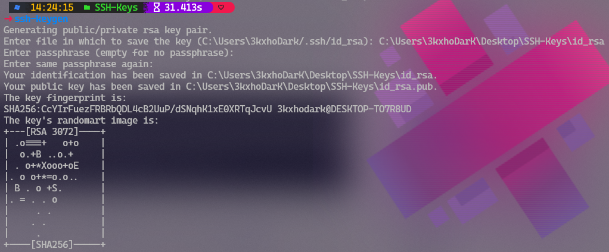
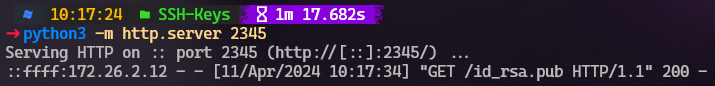
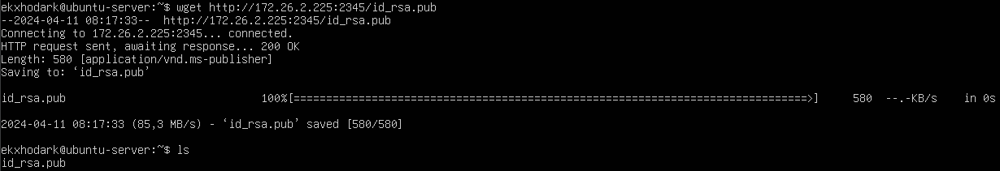
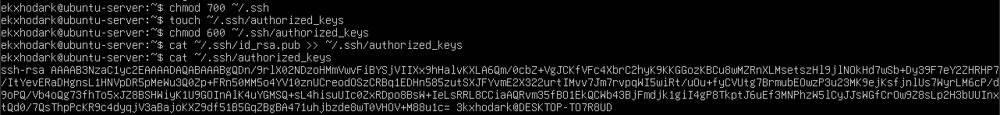
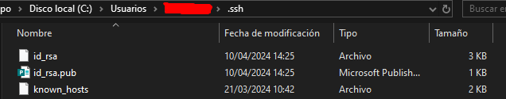
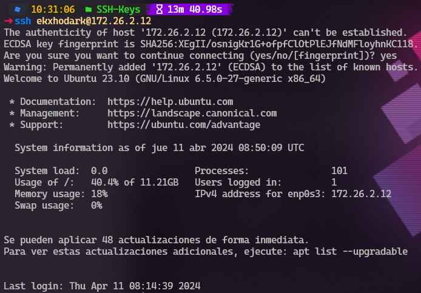
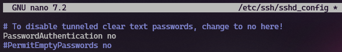
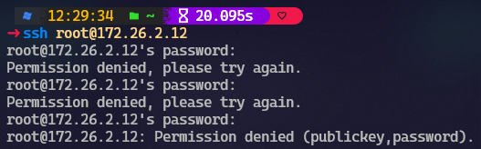

# Proyecto 9: Certificados digitales

## Parte 1

En primer lugar instalamos un servidor Ubuntu 23.10, con su servidor OpenSSH y la interfaz de red en modo Adaptador Puente, de modo que nos permita conectarnos al servidor desde nuestro host. 

Ya instalada y preparada la máquina, vamos a nuestro host (Windows 10) y generamos el par de claves pública y privada en la carpeta SSH-Keys (Podríamos generarlas directamente en el directorio *C:\\Users\\{Username}\\.ssh*, pero vamos a copiarlas allí después de transpasar la clave pública al servidor Ubuntu).

Como hemos mencionado, debemos copiar nuestra clave pública al servidor Ubuntu, así que para ello hemos decidido abrir un pequeño y momentáneo *servidor http* en el puerto *2345* con *python 3*, para poder descargar la clave directamente desde Ubuntu Server con *wget*. 

Con la clave pública ya descargada, la movemos al directorio **~/.ssh** del servidor.

Con esta clave ya en su sitio, copiaremos su contenido al fichero **~/.ssh/authorized_keys**. Antes de hacer esto, nos aseguraremos de asignar los permisos correctos al directorio ssh, cerciorarnos que el fichero authorized_keys existe y asignarle los permisos adecuados.

Como ya tenemos todo configurado, sólo hace falta copiar el par de claves al directorio **C:\\Users\\{Username}\\.ssh**.

Finalmente, accedemos vía ssh al servidor Ubuntu Server, y escribimos "*yes*" cuando nos pregunte si queremos continuar conectándonos.

Como ya podemos autenticarnos a través de nuestra clave pública, deshabilitaremos el acceso por ssh con contraseña, para mayor seguridad. Así evitaremos también ataques por fuerza bruta. Para ello, editaremos el fichero **/etc/ssh/sshd_config**, y cambiaremos a **no** el estado de la variable **PasswordAuthentication**. Luego reiniciaremos el servicio ssh.

Como podemos ver, con esta configuración nueva, no nos dejará acceder al servidor vía SSH por contraseña.

