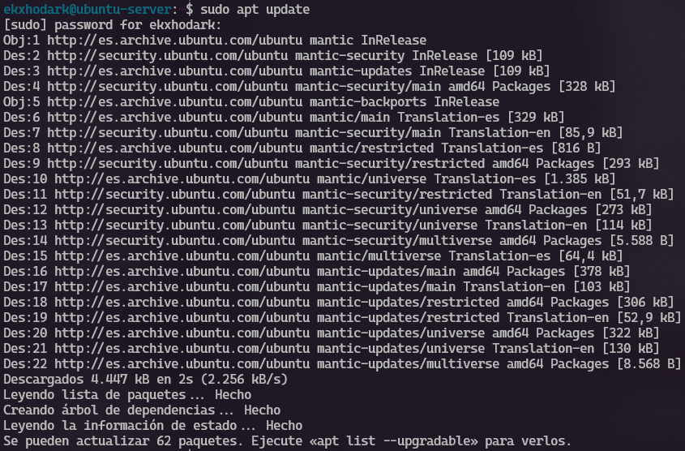
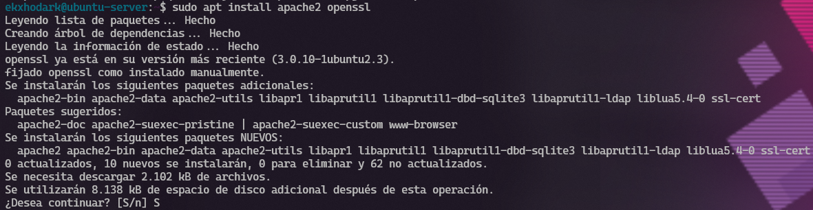
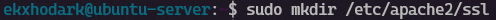
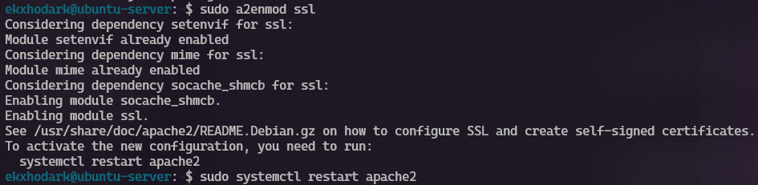
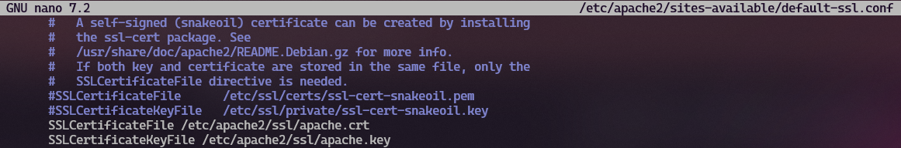
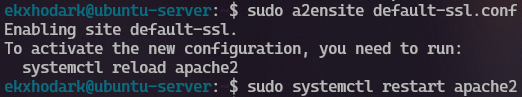
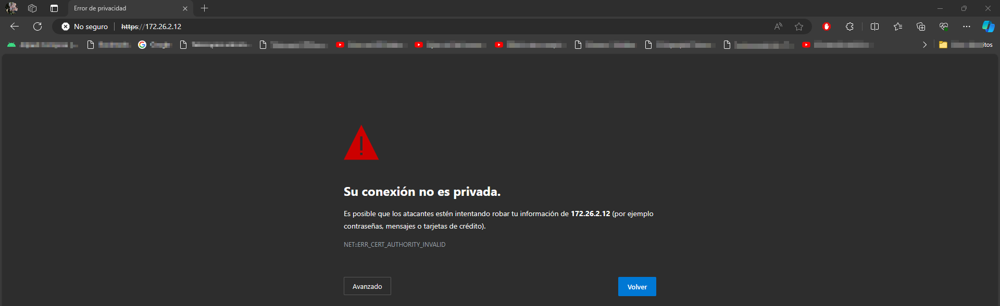
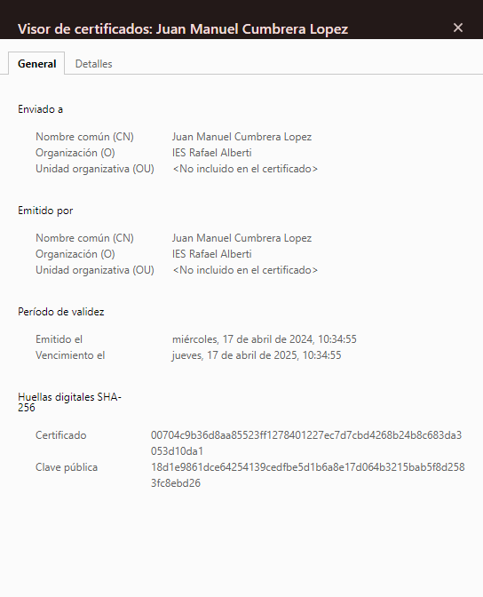
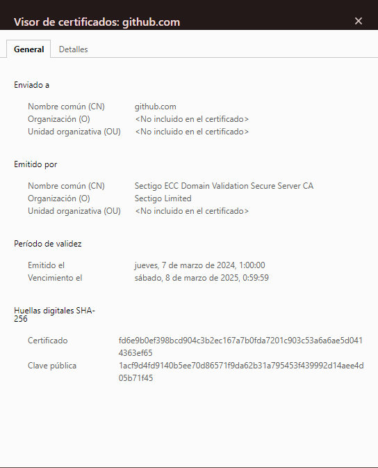

# Proyecto 9: Certificados digitales

## Parte 2

En primer lugar actualizamos la lista de paquetes presentes en los repositorios del servidor Ubuntu con `sudo apt update`, y tras terminar este proceso instalamos **Apache** y **OpenSSL**.

Creamos un directorio para almacenar los archivos relacionados con SSL.

Generamos el certificado autofirmado y la clave privada.

Habilitamos en módulo SSL.

Editamos el archivo de configuración para el sitio web en la carpeta `/etc/apache2/sites-available/default-ssl.conf` y modificamos las siguientes líneas para apuntar al certificado y a la clave privada:

Habilitamos el sitio SSL y reiniciamos Apache para que los cambios surtan efecto.

Tras haber configurado al completo Apache y el certificado autofirmado, accedemos a nuestra página web desde el navegador, topándonos con un error `NET::ERR_CERT_AUTHORITY_INVALID`, que nos indica que la autoridad certificadora que ha firmado nuestro certificado no es válida.

Al profundizar en los detalles de nuestro certificado y compararlo con uno válido, como el de la popular plataforma web [Github](https://github.com/), podemos observar una diferencia significativa. Mientras que nuestro certificado autofirmado refleja los datos que proporcionamos al generar el certificado, el certificado de Github cuenta con la firma de una entidad de confianza: la reconocida empresa [Sectigo Limited](https://www.sectigo.com/). Sectigo es una autoridad certificadora de renombre a nivel mundial, cuya firma es ampliamente aceptada y confiable en la comunidad de seguridad digital.

La ausencia de la firma por parte de una entidad certificadora reconocida es la causa principal del error de validación de nuestro certificado. Este proceso de validación y firma por parte de una compañía externa agrega una capa adicional de seguridad y confianza a nuestro sitio web. Implica que nuestro sitio ha sido evaluado y aprobado por una entidad externa, lo que aumenta la confianza de los usuarios al garantizar la autenticidad y la integridad de la conexión segura.