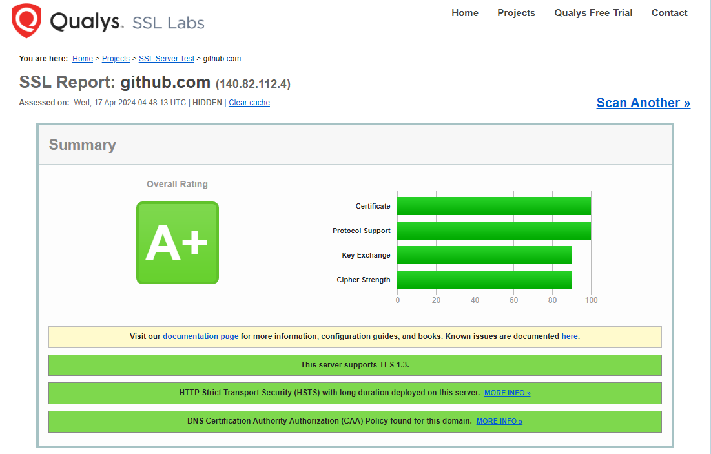

# Proyecto 9: Certificados digitales

## Parte 3

Escogemos el servicio [SSL Labs](ssllabs.com) para analizar el certificado del sitio web Github. Cuanfo introducimos su URL, vemos inmediatamente una calificación general de **A+**, lo que demuestra ampliamente la validez del certificado de la página web github.com.

Desgranando la información que nos ofrece la página SSL Labs sobre el certificado de Github, llegamos a las siguientes conclusiones:

- Se ha encontrado una política de Autorización de Autoridad de Certificación (CAA) en el registro DNS del dominio en cuestión. El CAA es un mecanismo de seguridad utilizado por los propietarios de dominios para especificar qué autoridades de certificación (CAs) están autorizadas para emitir certificados SSL/TLS para ese dominio en particular. Esta política permite a los propietarios de dominios ejercer un mayor control sobre qué CAs pueden emitir certificados para sus dominios y ayuda a prevenir la emisión de certificados no autorizados.

- Se ha implementado la política de seguridad de transporte estricto de HTTP (HSTS) en el servidor y que la duración de esta política es larga. El HSTS es un mecanismo de seguridad de HTTP que permite a un sitio web indicar a los navegadores web que solo se comuniquen con él a través de HTTPS, incluso si el usuario intenta acceder al sitio utilizando HTTP. Esto ayuda a proteger contra ataques de tipo SSLstrip, donde un atacante intenta forzar una conexión HTTP en lugar de HTTPS, comprometiendo la seguridad de la comunicación. La "larga duración" se refiere al tiempo durante el cual el navegador debe recordar la política de HSTS. Cuando un servidor envía la política de HSTS al navegador, puede especificar la duración de la política, que es el período de tiempo durante el cual el navegador debe seguir la política de HSTS sin excepciones. Una duración más larga significa que el navegador seguirá la política de HSTS durante más tiempo, mejorando la seguridad a largo plazo del sitio web.

- El servidor soporta las versiones 1.2 y 1.3 del protocolo TLS  (Transport Layer Security), de manera que se ofrece seguridad y rendimiento mejorados a los clientes que se conectan a él, garantizando que las comunicaciones estén protegidas utilizando los mecanismos de cifrado y seguridad más avanzados disponibles. El protocolo TLS es un protocolo criptográfico utilizado para asegurar la comunicación sobre una red de computadoras. Este garantiza que los datos transmitidos entre un cliente y un servidor estén cifrados y protegidos.

- El certificado utiliza el algoritmo RSA con una longitud de clave de 4096 bits para la encriptación y la firma digital, y utiliza el algoritmo de hash SHA-256 con RSA para la firma digital del certificado.

    

- Se muestran en orden de preferencia los conjuntos de cifrado disponibles para TLS 1.3.

    

- Estos son los conjuntos de cifrado disponibles para TLS1.2, en orden de preferencia.

    

- A continuación vamos una lista de clientes y/o plataformas capaces de navegar por la página web github.com, así como los cifrados utilizados por cada uno de esos clientes durante el proceso de handshake con el servidor de GitHub. Cada entrada en la lista describe el cliente o plataforma, el tipo de cifrado utilizado, la versión del protocolo TLS, la suite de cifrado específica, el grupo de curva utilizado para el intercambio de claves ECDH (si corresponde) y si se proporciona secreto adelantado (FS).

    

- La siguiente sección proporciona una visión detallada de la configuración de seguridad y las características de cada protocolo listado implementadas en el servidor, del mismo modo que la susceptibilidad del mismo ante ciertos tipos de ataques, como BEAST attack (Browser Exploit Against SSL/TLS), POODLE (SSLv3) o Downgrade attack (Ataque de degradación de protocolo).

    

A través de la misma página que hemos usado para analizar la configuración del servidor web SSL de Github, pudimos encontrar en las búsquedas del sitio tres páginas web con certificados no válidos. A continuación, mostraremos el mensaje de error obtenido al tratar de acceder a cada uno de los sitios, así como una breve explicación del motivo de este error.

- **Sitio Web:** wiki.cifprodolfoucha.es
- **Mensaje de Error:** NET::ERR_CERT_DATE_INVALID

De acuerdo con el análisis de *SSL Labs*, el certificado digital del sitio web *wiki.cifprodolfoucha.es* no es considerado válido principalmente debido a que su fecha de validez indica que ha expirado hace 19 horas.

- **Sitio Web:** ae4ca1cc18b0046c3ab6b2e04677895d-1510882436.us-east-1.elb.amazonaws.com
- **Mensaje de Error:** NET::ERR_CERT_COMMON_NAME_INVALID

Si tratamos de acceder a la página mencionada arriba, nos encontraremos con que el nombre común (Common Name) especificado en el certificado no coincide con el nombre del sitio al que se está intentando acceder, siendo el motivo principal tras la invalidez del certificado del sitio. Aún así, introducimos el enlace en SSL Labs, donde encontramos que además, no se especificaron nombres alternativos en el certificado, este ya expiró el 23 de noviembre de 2023, carece de soporte para Certificate Transparency, lo que significa que este certificado no ha sido registrado en un registro de transparencia de certificados. Por último, no tiene soporte para DNS CAA, lo cual indica que el dominio no tiene registros de autorización de certificado (CAA) configurados.

- **Sitio Web:** ipflow-frankfurt.cloud.deloitte.fr
- **Mensaje de Error:** NET::ERR_CERT_AUTHORITY_INVALID

Tras investigar las razones de la invalidez del certificado de la página mencionada, nos damos cuenta que su certificado no ha sido registrado en un registro de transparencia de certificados. Además, se hace notoria la falta de soporte para DNS CAA, que significa que el dominio no tiene registros de autorización de certificado (CAA) configurados. Por último, vemos que el sitio web SSL Labs marca el mensaje *Contains anchor*, lo que sugiere que puede haber un problema en la cadena de certificados, posiblemente relacionado con la autoridad de certificación raíz.

